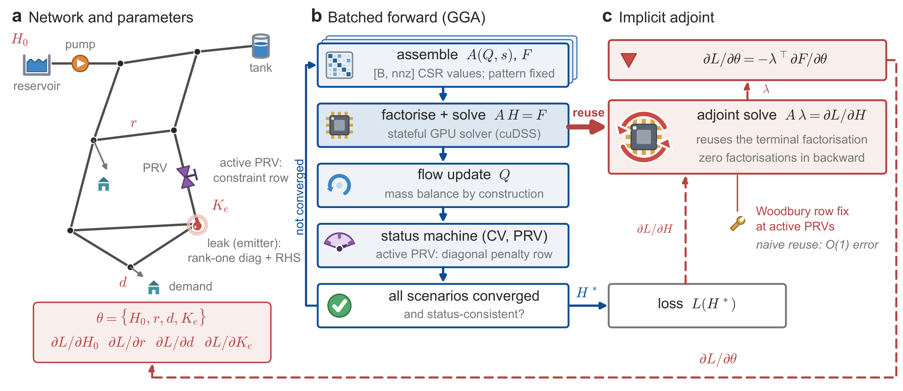

# HydroGrad

**A bit-faithful, differentiable re-implementation of the EPANET 2.2 hydraulic engine in PyTorch.**
Distributed as the Python package `dgga`; repository `wdsgpu`.

[](LICENSE)
[](pyproject.toml)
[](https://pytorch.org)
[](#installation)
[](datasets/README.md)
[](#citation)

HydroGrad keeps the reference numerical scheme of water-network hydraulics
exactly as it ships and makes it differentiable. The `epanet` path reproduces
the EPANET 2.2 reference engine bit for bit: the same global gradient
algorithm, transcribed statement by statement from the EPANET 2.2.0 C sources,
with the same status machine, control and rule logic and extended-period time
stepping. Two further paths share that parser, network object and coefficient
formulas and return exact adjoint gradients of the as-shipped algorithm with
respect to nodal demands, pipe resistances, reservoir heads, pump curve
coefficients and emitter (leak) coefficients: a batched dense path (CPU or
CUDA) and a sparse batched GPU route (NVIDIA cuDSS) with a GPU implicit
adjoint that reuses the forward pass's terminal factorisation.

<p align="center">
  
</p>

The repository is the code and data release of the accompanying paper (see
[Citation](#citation)). Every number on this page is copied from a
measurement report in [`data/`](data/); the file is named next to it.
Nothing is estimated, and the unflattering entries are kept.

## Highlights

| what was measured | result | evidence |
|--|--|--|
| Forward verification against the double-precision EPANET 2.2 library, 52 networks, 8 140 extended-period frames | **52 / 52 agree to at most 1e-12 ft over every frame, 25 of them exactly; the largest deviation is 1.137e-13 ft** (Richmond), with reservoir heads and valve settings read from the input text, as in Table 1 of the paper. On the default parser path five networks fall short of 1e-12 ft (Anytown 6.082e-12, Net3 2.146e-6, BWSN Network 1 6.086e-6, Net6 2.300e-5, BWSN Network 2 6.836 ft): a model in US customary units loses one unit in the last place on those two field classes in the metre round trip, and a reservoir head is a boundary condition, so the error is amplified. Reading the two classes from the input text is a non-default parser entry point; every other number in this repository was produced on the default path, which it leaves unchanged to the last bit. Per-frame Newton iteration counts are identical to EPANET's on all 52 either way | `data/exempt/verify_exact_fix.json` (the five networks, before and after, every frame); `data/benchmark_report.txt`, `data/tables/tab_full_benchmark.csv` (default path, all 52) |
| Regression suite, 54 items | **54 / 54 pass**; item 1: 25 steady-state alignments (City D, City D with emitters, the 23 synthetic networks) at max abs. head deviation 2.842e-14 ft, i.e. bit level; item 9: exact symmetry of the GGA matrix, 86 / 86 bit-exact and 4 / 4 one-sided-assembly mutants correctly caught | `data/regression_report.txt` (2026-08-25) |
| Gradient checks | implicit adjoint against central finite differences, worst 5.85e-08 relative (City D, 80 coordinates, four parameter classes); unrolled route 1.21e-06; batched against per-scenario gradients 0.000e+00; `torch.gradcheck` pass; 22 / 22 adversarial audit; finite differences driven through EPANET's own library against the analytic gradient, worst 2.39e-05 over 8 coordinates | `data/regression_report.txt` appendices A and B, `data/tables/tab_gradient.csv`, `data/extfd_epanet_report.txt` |
| One adjoint instead of 555 simulations | City D has 554 links (`benchmark_report.txt`: N = 542, L = 554). A one-sided finite-difference Jacobian over 554 link coordinates costs 555 hydraulic simulations; one adjoint solve, with the sparsity of the forward solve, returns all 554 sensitivities | arithmetic on the recorded link count; `data/placement_metric_wip.txt` |
| The structure of the gradient on an operational network (City D census) | of the 554 link coordinates, **279** carry informative gradients under the sensor set, **149** are unobservable, **41** lie on dead branches, **6** sit against parameter clamps, and **79** are throttle control valves that carry no roughness (279 + 149 + 41 + 6 = 475 pipes) | `data/audit_augment_wip.txt` (`census_partition`), `data/placement_metric_wip.txt`, `data/benchmark_report.txt` (TCV79) |
| L-TOWN (782 junctions, 3 PRVs), forward plus backward, one scenario at B = 1024 | **489 ms** with the previous serial CPU adjoint to **1.54 to 2.31 ms** with the GPU implicit adjoint on the cuDSS route (two RTX 5090 nodes); re-measured best-of 1.612 to 1.617 ms, 198 to 201x end to end | `data/adjoint_gpu_wip.txt` section 2, `data/tables/tab_ltown_fb.csv`, `data/mainline_v2_wip.txt`, raw `data/gpu/5090_ajg_*.out`, `5090_mv2_*.out` |
| L-TOWN device memory, forward plus backward at B = 1024 | **1 286 MiB** (cuDSS route) against **29 096 MiB** (dense path), 22.6x; on a 32 GiB card the dense path first fails at B = 1280 while the sparse route was scanned to B = 16384 (18 518 MiB) without reaching its boundary | `data/tables/tab_ltown_mem.csv`, `data/mainline_v2_wip.txt` section 3 |
| L-TOWN forward only, dense against cuDSS | 1.27 to 1.51x at B = 1 rising to 4.36 to 6.42x at B = 1024 | `data/tables/tab_ltown_forward.csv`, `data/mainline_evidence.md` |
| Batched forward on City D (542 nodes), GPU float64, B = 256 | 2.180 ms per scenario on an RTX 5060 Laptop against the EPANET library's 0.171 ms solve-only and 1.021 ms end to end; 0.461 ms on an RTX 5090; batched results bit-identical to solving scenarios one at a time | `data/bench_batch_readme_run.txt`, `data/gpu/README.md` |
| Batched status machine with PRVs | raises the number of the 21 public benchmark networks the batched path can solve from 11 to 18 | `data/prv_port_wip.txt`, `scripts/prv_port/count_unlock.py` |
| The two paths that refuse | float32 drifts 126.6 ft on all four GPUs tested; the cuDSS route and the GPU adjoint raise on every unsupported case instead of falling back | `data/gpu/README.md`, `data/p3_autograd_wip.txt`, `data/adjoint_gpu_wip.txt` |

Read the table with its caveats: the bit-level figures are Windows x64
figures against the `epanet22.dll` that ships inside WNTR
([Bit-exactness, and its limits](#bit-exactness-and-its-limits)); the
forward-plus-backward speed-up on L-TOWN is mostly the adjoint moving from a
serial CPU loop to the GPU (factor F1, 50 to 57x at large B) and only in part
sparse against dense linear algebra (factor F2, 3.1 to 3.8x), as
`data/tables/tab_ltown_fb.csv` separates them.

## What is in the box

| path | contents |
|--|--|
| `dgga/` | the package: parser, units, the three solver paths, EPS driver, rule engine, the two backward routes, reference bindings, and the application modules (calibration, sensor placement, cluster localisation, optimiser) |
| `scripts/` | the regression and guard suites, reference builders, the fetch script with SHA-256 manifest, gradient and adversarial checks, the GPU measurement drivers behind every table, and the experiment drivers of the paper (`docs/repository_map.md` lists which script produced which report) |
| `data/` | every measurement report the paper cites, the raw cluster job outputs under `data/gpu/`, and the paper's tables as CSV under `data/tables/` |
| `datasets/` | City D and City H, two anonymised operational models, and 256 leak repair work orders for City D, under CC BY 4.0 |
| `networks/` | 23 synthetic networks (`random_main/`, `random_small/`) with their generator and SHA-256 manifest under `synthetic/`; `public/` is created by the fetch script |
| `tests/` | eight CPU smoke tests that run on a fresh clone in seconds |
| `deploy/` | the Slurm bundle of the cross-GPU benchmark and the Volta environment recipe |
| `docs/` | `linux_gpu_hosts.md` (what changes off Windows, with the libm attribution), `repository_map.md` |

## Installation

Python 3.10 or later. The package has no platform-specific code; the
bit-level claims are platform-dependent (see below).

**CPU path** (the bit-exact replica, the dense batched path on CPU, the CPU
implicit adjoint): four dependencies.

```bash
git clone https://github.com/mutianwei521/wdsgpu.git
cd wdsgpu
pip install -e .            # numpy, scipy, torch, wntr
pip install -e ".[dev]"     # + pytest, matplotlib
python -m pytest -q tests   # 8 tests, a few seconds, no downloads
```

`wntr` supplies the INP parser and, for the reference and benchmark pipeline
only, the double-precision EPANET 2.2 library that HydroGrad compares itself
against. The differentiable solver never calls EPANET.

**GPU, dense path**: any CUDA build of PyTorch. Verified with torch
2.13.0+cu132 (RTX 5060 Laptop), 2.11.0+cu128 (RTX 5090, RTX 4090),
2.14.0+cu126 (Tesla V100) and 2.7.1+cu118 (RTX 3090, `data/gpu/3090_gpu_bench.json`). Use cu128 or later
wheels for Blackwell (sm_120) and cu126 wheels for Volta (sm_70; the cu128
wheels drop it).

**GPU, sparse route** (`assemble="csr", linear_solver="cudss"`) and the GPU
implicit adjoint on it: CUDA, float64 and the cuDSS bindings of
`nvmath-python`.

```bash
pip install -e ".[cudss]"   # nvmath-python[cu12]==1.0.0 (cuDSS 0.8)
```

On a Volta host with driver 580 additionally pin `cuda-core==1.1.1`
(`deploy/v100/setup_env.sh`; the reason is recorded in
`docs/linux_gpu_hosts.md`). The route raises, with the reason, when CUDA,
`nvmath` or float64 is missing; there is no silent fallback.

**Global-optimiser baselines** of the calibration study need `cma`
(`pip install -e ".[baselines]"`).

**Benchmark networks** are not redistributed. Fetch them from their upstream
sources with SHA-256 verification against the exact bytes the reports were
produced from:

```bash
python scripts/fetch_benchmarks.py                 # 20 networks, about 5 MB
python scripts/fetch_benchmarks.py --list          # sources and licences, no download
python scripts/fetch_benchmarks.py --only-licensed # CC BY 4.0 / MIT / BSD-3 rows only
python scripts/fetch_benchmarks.py --with-large    # + L-TOWN_Real.inp (169 MiB)
```

Verified versions on the reference workstation (Windows 11 x64): Python
3.12.13, numpy 2.5.1, scipy 1.18.0, torch 2.13.0+cu132, wntr 1.5.0.

## Quick start

Solve Hanoi with the bit-exact path and differentiate a downstream head with
respect to every nodal demand in one adjoint solve. Run from the repository
root after `python scripts/fetch_benchmarks.py Hanoi`.

```python
import torch
from dgga.parse import parse_inp
from dgga.solver import GGASolver
from dgga.autodiff import implicit_solve

INP = "networks/public/Hanoi.inp"                       # fetched by scripts/fetch_benchmarks.py Hanoi
net = parse_inp(INP)                                    # EPANET INP -> Net (internal units: ft, cfs)
solver = GGASolver(net, mode="epanet", inp_path=INP)    # the bit-exact EPANET 2.2 replica
demand = torch.as_tensor(net.demand_cfs_at(0)).requires_grad_(True)
res_head = torch.as_tensor(net.reservoir_head_ft_at(0))
head, flow, emitter = implicit_solve(solver, demand, res_head)   # forward + implicit-function adjoint
head[net.node_id.index("31")].backward()               # dH[31]/d(demand) for every node, one adjoint solve
print(f"head at node 31 = {head[net.node_id.index('31')].item():.6f} ft")
print(f"dH31/dq at node 12 = {demand.grad[net.node_id.index('12')].item():.6e} ft per cfs")
```

Output on the reference workstation (2026-09-05):

```
head at node 31 = 102.837150 ft
dH31/dq at node 12 = -1.489632e+00 ft per cfs
```

The same lines run offline on one of the shipped synthetic networks: replace
`INP` with `networks/random_main/rand_0009.inp` and the two node ids with
`"J31"` and `"J12"`.

Three things to know before going further:

- All internal quantities are in EPANET's internal units (heads and lengths
  in ft, flows in cfs) whatever units the INP file declares; conversions
  happen at the parse and report boundary (`dgga/units.py`).
- `implicit_solve(solver, demand, res_head, ke=..., r_hw=...)` differentiates
  with respect to demands, reservoir heads, emitter coefficients and pipe
  resistances at once and returns `(head, flow, emitter)`.
- The emitter coefficient `ke` is EPANET's *internal* one, `Ucf / C**(1/gamma)`,
  which runs opposite to the `[EMITTERS]` coefficient `C`: a larger `ke` is a
  smaller leak, and `ke = 0` means no emitter at all. Put the coefficient in
  the INP file and read `solver.node_ke_default` if you want the INP's units.

## Choosing a path

| path | call | what it is | differentiable |
|--|--|--|--|
| `mode="epanet"` | `GGASolver(net, mode="epanet").solve(...)` | the bit-exact replica: EPANET's own sparse Cholesky ordering, status machine, `[CONTROLS]` and `[RULES]`, full extended-period simulation | no (it is the reference, not a model); `implicit_solve` uses its converged state for the CPU adjoint |
| `mode="dense"` with the defaults `assemble="dense"`, `linear_solver="dense"` | `solver.solve(...)`, `solve_unrolled(...)`, `implicit_solve(..., adjoint="gpu")` | batched dense Cholesky on `[B, Nj, Nj]`, CPU or CUDA; a batched status machine (`dense_status_machine=True`) covers check valves, pumps, tanks and PRVs | yes |
| `assemble="csr"`, `linear_solver="cudss"` | `solver.solve(..., assemble="csr", linear_solver="cudss")` and the same keywords on `implicit_solve` | CSR values on `[B, nnz]` whose per-iteration matrix is bit-identical to the dense assembly, factorised by cuDSS with a hand-written adjoint | yes; CUDA, float64 and `nvmath` only |

The three defaults are frozen: `mode="epanet"`, `assemble="dense"` and
`linear_solver="dense"` reproduce their recorded numbers bit for bit, and
every new capability is reached through a new keyword. Where the crossover
between the dense and the sparse route lies (about 300 junctions forward, lower
with a backward pass), how to size the cuDSS cache
(`cudss_cache_max`, `cudss_grad_slots`, `cudss_grad_refine`) and why
`cudss_grad_slots` should stay at 1 are measured in `data/p4_remeasure_wip.txt`
and `data/sparse_gpu_plan.md`.

What refuses, and how (`data/p3_autograd_wip.txt` section E, `data/adjoint_gpu_wip.txt`, checked on CPU by `scripts/p2_cudss/smoke_cpu_guards.py`):

| you ask for | what happens |
|--|--|
| `linear_solver="cudss"` with `assemble="dense"` | `ValueError` |
| `linear_solver="cudss"` with `mode="epanet"` | `NotImplementedError`: the replica does not accept a substitute linear solver |
| `linear_solver="cudss"` on CPU, in float32, or without `nvmath` | `NotImplementedError` |
| `create_graph=True` through the cuDSS adjoint | `NotImplementedError`: use the dense path for second derivatives |
| `cudss_grad_slots > cudss_cache_max` | `ValueError` |
| `solve_unrolled` on any PRV network | raises at construction or call; PRV gradients go through `implicit_solve` |
| GPU adjoint on pump-parameter gradients, Darcy-Weisbach, the clamped branch of constant-power pumps, cascaded PRVs sharing a downstream node, float32, unconverged scenarios | raises, by name |
| PBV or GPV valves, pressure-driven demand, tanks with volume curves, `DAMPLIMIT`, water quality | not implemented; rejected at parse or construction time |

## Reproduce the paper

Every table and figure has a script and a report. Wall times are the ones
recorded in the report headers (workstation: 24 CPU threads, RTX 5060 Laptop
GPU; cluster: RTX 5090 nodes under Slurm). The scripts write Chinese progress
text; the numbers and file names are what the paper cites.

**52-network verification table and the accuracy figure**
(`data/benchmark_report.txt`, `data/tables/tab_full_benchmark.csv`):

```bash
python scripts/fetch_benchmarks.py                 # the 21 public networks
python scripts/build_public_reference.py           # EPANET reference solutions, data/reference/ (git-ignored)
python scripts/build_random_reference.py           # the 23 synthetic networks
python scripts/validate_reference.py pub_hanoi     # mass balance / demand / head-loss cross-checks
python scripts/benchmark_sweep.py                  # measured: 1 275 s for 52 networks
python scripts/benchmark_sweep.py --stems pub_hanoi pub_net3   # a subset
python scripts/exempt_diag/verify_exact_fix.py     # the five networks that reach Table 1's values only with reservoir heads and valve settings read from the input text
```

`benchmark_sweep.py` runs the default parser path and reproduces `data/benchmark_report.txt`. Table 1 of the manuscript additionally reads reservoir heads and valve settings from the input text; `verify_exact_fix.py` applies that entry point to the five affected networks and reports both readings.

`benchmark_sweep.py` discovers its network list from `data/reference/*_meta.json`,
so the two commands above cover 44 of the 52 rows on a fresh clone. City D and
City H (3 rows) are reproducible from `datasets/`; the `EXA*` and `ky3`/`ky5`
rows need models that are not distributed (`THIRD_PARTY.md`, section 3).

**Regression suite** (`data/regression_report.txt`, 54 items, 285 s):

```bash
python scripts/regression_all.py                   # writes data/regression_report.local.txt
python scripts/check_symmetry.py                   # item 9 alone: exact symmetry of A, with mutants
python scripts/check_schedule.py                   # item 10: status-machine schedule, with mutants
python scripts/regression_gpu.py                   # the 54 cuDSS-route invariants (CUDA + nvmath; exit 2 = skipped, with the reason)
```

**Gradient tables** (`data/tables/tab_gradient.csv`, regression appendices A
and B, `data/extfd_epanet_report.txt`, `data/extfd_calib_report.txt`):

```bash
python scripts/gradcheck_3way.py                   # unrolled vs implicit vs central FD (City D, Synthetic-M9)
python scripts/gradcheck_dw.py                     # Darcy-Weisbach adjoint vs FD (Balerma)
python scripts/audit_grad_adversarial.py           # 22-item adversarial audit
python scripts/extfd_epanet.py                     # finite differences through EPANET's own library
python scripts/exempt_diag/ulp_selfdrift.py        # the 1-ulp control experiment behind the exemption
```

**Batched and GPU cost** (`data/bench_batch_readme_run.txt`,
`data/bench_scaling.json`, `data/gpu/`):

```bash
python scripts/bench_batch.py                      # City D, CPU/GPU, B = 1, 64, 256; needs data/reference for City D
python scripts/bench_scaling.py                    # per-frame cost against network size
python deploy/paracloud/gpu_bench.py               # self-contained cross-GPU benchmark (copy dgga/ next to it)
```

**L-TOWN tables** (`data/tables/tab_ltown_forward.csv`, `tab_ltown_fb.csv`,
`tab_ltown_mem.csv`; evidence `data/mainline_evidence.md`,
`data/mainline_v2_wip.txt`, `data/adjoint_gpu_wip.txt`): cluster jobs, one
card each, two nodes per table.

```bash
python scripts/ltown_mainline/correct_ltown.py     # correctness against the library, CPU
python scripts/adjoint_gpu/check_adjoint_gpu.py    # GPU adjoint acceptance (needs CUDA)
sbatch scripts/mainline_v2/mv2.sh                  # time, memory, big-network cells, training loop
python scripts/ltown_mainline/lt_merge.py          # merge the two nodes' outputs into the interval tables
```

**Crossover and memory tables of the sparse route**: `scripts/p4_remeasure/`
(`p4rt.sh`, `p4rm.sh`, `p4r7.sh`, `p4r_merge.py`) and `scripts/p4_closeout/`
(`p4c_agree_check.py`, `p4c_dense_reach.py`); reports `data/p4_remeasure_wip.txt`,
`data/p4_closeout_wip.txt`.

**Application studies on the released data** (City D, L-TOWN, Hanoi):

```bash
python scripts/calibrate.py --stage ...            # roughness calibration and the sigma ladder (data/calib_gc1_*.json)
python scripts/baselines_calib.py                  # CMA-ES / DE / PSO baselines (data/baselines_*.json)
python scripts/compare_calib.py                    # paired comparison (data/gd_comparison_report.txt)
python scripts/place_sensors.py --stage full       # D-optimal placement (data/placement_*.json)
python scripts/placement_metric.py                 # identifiability census, 279/149/41/6 (data/placement_metric_wip.txt)
python scripts/augment_suite.py --net city_d       # sensor augmentation (data/augment_suite_city_d.json)
python scripts/augment_coherence.py                # coherence-driven augmentation (data/augment_coherence.json)
python scripts/coh_controls.py --stage report      # its random controls (data/coh_controls.json)
python scripts/cluster_localisation.py             # cluster-level leak localisation (data/cluster_localisation.json)
python scripts/optimizer_v2.py                     # first-order optimiser study (data/optimizer_v2_*.json)
python scripts/demo_leak_inversion.py              # the leak-inversion demonstration (data/demo_leak_inversion.json)
python scripts/audit_augment/hv_report.py          # hostile re-verification of the augmentation package
```

Each driver prints its stages with `--help`; several read a sensitivity cache
(`data/placement_cache_*.npz`, rebuilt by `place_sensors.py --stage full`)
that is not tracked.

**Manuscript figures and tables**: `python scripts/make_paper_figs.py` reads
`data/` and writes `paper/figs/` and `paper/tables/` (the manuscript sources
themselves are not part of this repository; the CSV tables it produced are
under `data/tables/`).

**Datasets**: `python scripts/make_public_dataset.py --verify-only` re-runs the
losslessness check of the anonymisation; it compares the released files with
the unpublished originals, so it runs only where both are present.

## Bit-exactness, and its limits

These are the paper's limitations, kept here in the same words because a
README that is more optimistic than the paper is a bug.

- **Bit-level agreement is platform-dependent and is a claim about one
  reference binary.** The 1e-14 ft figures were obtained on Windows x64, with
  `pow` and `log` called through the Windows C runtime so that transcendental
  results match the `epanet22.dll` inside WNTR. On Linux, `dgga` falls back to
  glibc, whose `pow` differs from `msvcrt` by exactly one ulp in 0.03 to 0.25
  per cent of the solver's calls, and agreement drops to the 1e-7 to 1e-5 ft
  level: the regression suite reports 42 / 54 on the V100 host, with every
  miss a bit-level comparison and every iteration count and link status still
  equal. EPANET itself moves by 8.41e-06 ft on City D between its Windows and
  Linux builds. Do not quote the 1e-13 / 1e-14 numbers for a non-Windows
  build or another EPANET binary without re-measuring
  (`docs/linux_gpu_hosts.md`, `data/gpu/v100_libm_attribution_20260903.txt`).
- **Four networks pass under an exemption, not on the threshold.**
  BWSN_Network_1, BWSN_Network_2, Net3 and Net6 ship with `ACCURACY = 0.001`.
  Perturbing one pipe roughness inside the library by one ulp moves the
  library's *own* answer by 1.3e-06 to 6.9 ft, the same order as our deviation
  from the unperturbed library (larger than ours on BWSN_Network_2, within a
  factor of two on the other three), with iteration counts and statuses
  identical. A 1e-6 ft criterion is unreachable there for any implementation
  (`data/exempt/`, `scripts/exempt_diag/`).
- **Two reference solutions are unconverged transients.** ky5 and
  BWSN_Network_2 stop rather than converge at their own `ACCURACY`; HydroGrad
  reproduces those states faithfully, which is not the same as their being
  right, and they must not be used as training labels. Net6 was validated on
  the first 70 of its 609 frames.
- **Gradients are gradients of a frozen status configuration.** Valve and pump
  switching is discrete; the backward pass freezes the status machine at the
  converged configuration, and derivatives with respect to parameters that
  would flip a status are one-sided at best. Where EPANET's low-flow
  linearisation is active, the derivative of head loss with respect to
  resistance is exactly zero, and the gradient reports it as zero.
- **The unrolled route is not usable everywhere.** `solve_unrolled` refuses
  every PRV network; its truncated-K demand gradient does not converge in K on
  Net3, City D, ky4 and NW_Model (a list of measured networks, not a
  conditioning criterion). Call `unrolled_grad_health` before trusting it on a
  new network, or use `implicit_solve`.
- **The dense and unrolled paths do not have the accuracy of the replica
  path.** They assemble and factorise the same system differently, so they sit
  at the reduction-order noise floor rather than at bit level: on City D, GPU
  float64 differs from CPU float64 by 2.515e-05 ft in the README run
  (`data/bench_batch_readme_run.txt`) and by 9.42e-06 to 2.16e-05 ft across
  the four GPUs tested (`data/gpu/README.md`), and the dense CPU path differs
  from the library by 1.137e-05 ft. Use `mode="epanet"` when what you need is
  EPANET's exact answer. float32 is unusable: 126.6 ft of drift on all four GPUs.
  The batched forward carries run-to-run jitter of up to 5.7e-06 ft on
  identical inputs from the scatter-add assembly, so two runs must not be
  compared with a fixed tolerance (`data/sparse_gpu_plan.md`, section 10.1).
- **HydroGrad is not faster than EPANET on one scenario.** At B = 256 the
  dense GPU path costs 2.18 ms per scenario on the laptop against the
  library's 0.17 ms of solve time, and reaches parity only on an RTX 5090.
  What it buys is the gradient and batching.
- **The leak-inversion demonstration is one tuned case.** Three simultaneous
  leaks on City D, 40 pressure sensors, 25 frames, 1 785 forward solves: with
  noise-free pressures the recovered support is exactly the three true nodes
  (worst leak-flow relative error 5.87e-07); with 0.1 ft of Gaussian pressure
  noise it fails, recovering none of them. Differentiability makes the inverse
  problem tractable, not well posed (`data/demo_leak_inversion.json`).
- **Coverage is 52 networks, not all of EPANET.** Chezy-Manning head loss is
  implemented but no suite network exercises it; 3 of the 10 flow units are
  exercised bit-exactly against the library, the other 7 are unit-tested only
  (`data/tables/tab_capability.csv`).
- **Research code.** Not validated for operational use; verify against EPANET
  on your own network before acting on a result.

## Datasets

`datasets/` holds two real municipal water distribution network models and one
year of field leak repair records, released in anonymised form under
**CC BY 4.0**: `city_d.inp` (541 junctions, 475 pipes, 79 throttle control
valves, LPS, Hazen-Williams, 24 h EPS), `city_h.inp` (920 junctions, 1 032
pipes, 6 pumps) and `city_d_leak_records.{csv,json}` (256 work orders, 230 of
them joined to a model junction). The two utilities are referred to only as
City D and City H.

The anonymisation, in the words of [`datasets/README.md`](datasets/README.md):
node coordinates and pipe vertices have had a fixed rigid-body transform
applied (translate, rotate by an unpublished angle, translate, round), so
they are metres under an unpublished rigid-body transform with no datum,
origin or north direction and must not be used for geolocation; the title,
provenance banner and map labels are replaced or removed; addresses and
metering-district names are deleted from the work orders and absolute dates
replaced by day offsets from an unpublished epoch; node, pipe, pump, valve,
pattern and curve identifiers are unchanged. EPANET never reads coordinates
during a hydraulic solve, and the transform is verified hydraulically
lossless: the original and the released model give `max|delta| = 0.0` on
every head and flow over the full extended-period simulation
(`scripts/make_public_dataset.py --verify`). Every result on this page that
uses City D is therefore reproducible from the released file. SHA-256 values
are in `datasets/SHA256SUMS.txt`; the field dictionary and the citation for
the data are in the datasets README.

The 23 synthetic networks under `networks/` are the authors' own, generated by
`networks/synthetic/generate_random_networks.py` (which regenerates all 23
byte for byte through WNTR's EPANET library on the reference workstation) and
released under the MIT licence. The 21 public benchmark networks are fetched,
not redistributed; sources and licences are in [`THIRD_PARTY.md`](THIRD_PARTY.md).

## Citation

The accompanying paper is deposited on arXiv; the identifier placeholder
below is filled on upload. `CITATION.cff` carries the same record in
machine-readable form.

```bibtex
@misc{mu2026hydrograd,
  author        = {Mu, Tianwei and Wang, Yue and Yuan, Mingzhe and Wang, Wenhong and
             Luo, Qing and Xiao, Min and Li, Jun and Yang, Hui},
  title         = {Water-network decisions share one hydraulic gradient, and it can now
                   be computed exactly},
  year          = {2026},
  eprint        = {arXiv:2609.06323v1},
  archivePrefix = {arXiv},
  note          = {Code and data:https://github.com/mutianwei521/wdsgpu}
}
```

## Licence

Code: MIT, see [`LICENSE`](LICENSE) (chosen for compatibility with EPANET
2.2, which is also MIT). Datasets under `datasets/`: CC BY 4.0. Synthetic
networks under `networks/`: MIT with the code.

## Acknowledgements

- **EPANET 2.2.0**, US EPA and the OpenWaterAnalytics community. HydroGrad is
  a re-implementation of their algorithm; the MIT-licensed C sources were the
  specification for every formula, coefficient and convergence rule here. No
  EPANET source file is redistributed. Not endorsed by, or affiliated with,
  the US EPA or OWA.
- **WNTR** (Sandia National Laboratories / US EPA, BSD-3-Clause): INP parsing
  and the double-precision EPANET 2.2 library used as the reference oracle.
- **NVIDIA cuDSS** through `nvmath-python`, for the sparse route.
- The curators of the public benchmark networks: the KIOS Research and
  Innovation Center of Excellence (EPANET-Benchmarks; BattLeDIM 2020 and
  L-TOWN), the BATADAL organisers (C-Town), the Centre for Water Systems at
  Exeter (Richmond, D-Town), the WaterFutures WaterBenchmarkHub (Modena,
  Pescara) and the University of Kentucky WDST project (ky4, ky10).
- The authors of the physics-informed graph network line of work, whose
  explicit statement of the non-differentiability of EPANET made the gap this
  work addresses concrete rather than implicit.
- Funding: the open fund of the Key Laboratory of Ecological Restoration of
  Regional Contaminated Environment (Shenyang University), Ministry of
  Education (KF-26-11), and the Guangdong Province Natural Science Foundation
  General Project (2026A1515011817).
